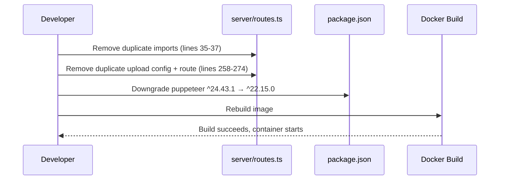

# Design Document: Fix Deployment Crash

## Overview

The tourops application container crashes on startup when using the `tourops:latest` image due to duplicate imports in `server/routes.ts` causing a compilation error, and a puppeteer version incompatibility with the Alpine Docker base image. This design documents the three-part fix: removing duplicate code, downgrading puppeteer, and verifying the /tours public access path.

## Architecture

The application is a monolithic Node.js/Express server with a React (Vite) frontend, deployed via Docker Compose with PostgreSQL and Redis.

```mermaid
graph TD
    A[Docker Compose] --> B[app: node:20-alpine]
    A --> C[db: postgres:16-alpine]
    A --> D[redis: redis:7-alpine]
    B --> E[dist/index.cjs - Built Server]
    E --> F[Express Routes]
    F --> G[multer upload handler]
    F --> H[puppeteer PDF service]
    F --> I[/api/tours/public - no auth]
```

## Root Cause Analysis

### Issue 1: Duplicate Imports (CRASH CAUSE)

`server/routes.ts` contains:
- **Lines 4-6**: First import of `multer`, `path`, `fs`
- **Lines 35-37**: Second duplicate import of `multer`, `path`, `fs` (causes redeclaration error)
- **Lines 39-50**: First `upload` multer config (destination: `public/uploads/images/`)
- **Line 155**: First `/api/upload` route using the first config
- **Lines 258-274**: Second `upload` multer config + second `/api/upload` route handler (duplicate)

The duplicate `import` statements cause a TypeScript/JavaScript compilation error that prevents the server from starting.

### Issue 2: Puppeteer Version Incompatibility

`package.json` specifies `puppeteer: ^24.43.1`. Puppeteer 24.x requires system Chromium dependencies not available in `node:20-alpine`. The Dockerfile does not install these dependencies. The last known working version was `^22.15.0`.

### Issue 3: /tours Redirect (Symptom)

The `/tours` page is correctly routed for unauthenticated users in `client/src/App.tsx` (line ~148 in the `!user` branch). It calls `/api/tours/public` which has no auth middleware. The redirect-to-login behavior is a symptom of the container crash making the API unreachable.

## Fix Strategy



## Components Affected

### server/routes.ts

**Problem**: Duplicate `multer`, `path`, `fs` imports and duplicate upload configuration/route.

**Fix**:
1. Remove lines 35-37 (duplicate imports)
2. Remove lines 258-274 (duplicate upload config and route handler)
3. Keep lines 4-6 (original imports), lines 39-50 (first upload config), and line 155 (first route handler)

**Postcondition**: Only one `import multer`, one `import path`, one `import fs`, one `upload` config, and one `/api/upload` route exist.

### package.json

**Problem**: `puppeteer: ^24.43.1` incompatible with `node:20-alpine`.

**Fix**: Change to `puppeteer: ^22.15.0`.

**Postcondition**: `npm install` and `npm run build` succeed in the Alpine container.

### Client Routing (No Change Needed)

The `AppRouter` component in `App.tsx` already handles unauthenticated `/tours` access:
```typescript
if (!user) {
  return (
    <Switch>
      <Route path="/tours" component={BrowseTours} />
      ...
    </Switch>
  );
}
```

And the server has an unauthenticated endpoint:
```typescript
app.get("/api/tours/public", async (_req, res) => { ... });
```

No code change needed — this resolves once the container starts successfully.

## Correctness Properties

*A property is a characteristic or behavior that should hold true across all valid executions of a system — essentially, a formal statement about what the system should do.*

### Property 1: No duplicate imports in routes.ts

*For any* valid build of the application, `server/routes.ts` SHALL contain exactly one import statement for each of `multer`, `path`, and `fs`.

**Validates: Requirement 1.1**

### Property 2: Single upload endpoint

*For any* valid build of the application, there SHALL be exactly one `/api/upload` route handler registered on the Express app.

**Validates: Requirement 2.1**

### Property 3: Puppeteer installs in Alpine

*For any* Docker build using `node:20-alpine`, `npm install` with the specified puppeteer version SHALL complete without errors.

**Validates: Requirement 3.1**

### Property 4: Public tours endpoint requires no authentication

*For any* HTTP GET request to `/api/tours/public`, the server SHALL respond with tour data without requiring authentication headers or session cookies.

**Validates: Requirement 4.1**

### Property 5: Build succeeds without errors

*For any* invocation of `npm run build`, the TypeScript compilation and bundling SHALL complete with exit code 0.

**Validates: Requirements 1.1, 3.1, 5.1**
